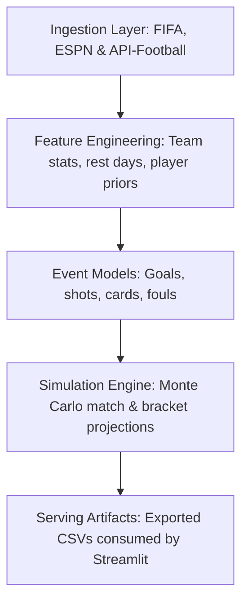

# 🏆 World Cup Forecasting Lab

[](https://www.python.org/)
[](http://localhost:8501)
[]()
[](LICENSE)

World Cup Forecasting Lab is a state-of-the-art football analytics sandbox designed for predicting match outcomes, simulating the tournament path, evaluating predictive models against market baselines, and optimizing the squad using player history priors.

The public interface is built using Streamlit and features a premium, high-contrast dark emerald theme, optimized for readability and responsive layout flow.

---

## 🔍 Core Objectives

This repository answers a broader question than team selection:
> **"How much forecasting signal can we recover from public tournament statistics, historical player performance, and market expectations when predicting World Cup matches?"**

Instead of relying on guesswork, this lab treats the World Cup as a repeatable, model-driven forecasting problem with measurable targets and rigorous backtests.

---

## 🗺️ Repository Structure

```text
brazil-world-cup-squad-optimizer/
|-- app/
|   `-- streamlit_app.py               # Streamlit application entrypoint & custom premium styles
|-- data/
|   |-- raw/                           # Raw ingested data from ESPN, FIFA, and API-Football
|   |-- processed/                     # Parsed & cleaned dataframes
|   |-- reference/                     # Static maps (team codes, country translations)
|   `-- serving/                       # Exported JSON/CSV artifacts consumed by the app
|-- reports/
|   |-- executive_summary.md           # Executive summary of project findings
|   `-- methodology/
|       `-- world-cup-forecasting-lab.md # Scientific methodology documentation
|-- src/
|   |-- evaluation/                    # Backtesting framework and model performance calculators
|   |-- features/                      # Feature engineering pipelines (team stats, rest days, form)
|   |-- ingestion/                     # Ingestion clients for ESPN API, FIFA, and API-Football
|   |-- models/                        # Prediction models (goals, shots, fouls, cards)
|   |-- pipelines/                     # Pipeline orchestrators (real-time ingestion & simulation)
|   `-- serving/                       # Utilities to write clean public data artifacts
|-- tests/                             # 58 unit and integration tests covering the complete pipeline
`-- README.md
```

---

## ⚙️ Data & Modeling Architecture

The forecasting system consists of four sequential stages:



### 1. Ingestion Layer (`src/ingestion/`)
- **FIFA official truth layer**: Extracts official match results, group tables, and tournament logs.
- **ESPN scoreboard parser**: A real-time fallback client fetching active scoreboards.
- **API-Football player priors**: Pulls historical player metrics (matches, goals, minutes) for squad enrichment.

### 2. Feature Engineering (`src/features/`)
- Computes rolling team form, home/away advantages, average goals, and rest day intervals.
- Maps player rosters to team aggregates to compute squad-level priors.

### 3. Event Models (`src/models/`)
- Simulates specific match dimensions independently:
  - **Goals (Poisson)**: Models offensive/defensive ratings.
  - **Shots, Fouls, and Cards**: Statistical distributions conditioned on team profiles.
- **Market Baseline**: Integrated bookmaker-style probability signals to act as a benchmark.

### 4. Simulation Engine (`src/pipelines/run_simulations.py`)
- Runs **10,000+ Monte Carlo iterations** to project group tables, qualification probabilities, knockout match outcomes, and the ultimate title-winner probability.

---

## 📈 Evaluation Stance & Baselines

All model outputs are validated against two reference points before publishing:
1. **FIFA Truth Data**: Act as the official ground truth for outcomes (using the FIFA official truth layer).
2. **Market Prices**: Set the market baseline that models must beat (or explain) to prove value.

Evaluating goals, cards, and shots independently allows the system to measure calibration and error per event family rather than relying on aggregate winner outcomes.

---

## 🖥️ Streamlit Interface Contract

The Streamlit app acts as a pure presentation layer. It consumes pre-computed artifacts stored under `data/serving/` to prevent runtime simulation delays:

| Artifact File | Description |
| :--- | :--- |
| `observed_match_results.csv` | Completed-match truth with source provenance and lineup context. |
| `coverage_summary.csv` | Explains target-by-target truth coverage published so far. |
| `match_predictions.csv` | Projected outcomes for future fixtures and predictions for past games. |
| `match_prediction_vs_actual.csv` | Scored accuracy calculations comparing prediction against actual results. |
| `group_forecast_summary.csv` | Projected group stage standings and points. |
| `knockout_forecast_summary.csv` | Horizontally-scrollable knockout bracket forecast. |
| `team_forecast_summary.csv` | Overall tournament outlook summarized by country. |
| `methodology_status.csv` | Publication and truth-coverage status by target. |
| `title_probability_summary.csv` | Championship win probabilities computed via Monte Carlo. |
| `top_scorer_forecast.csv` | Projected Golden Boot winners based on squad selection and pathway. |

---

## 🚀 Getting Started

### Prerequisites

Initialize a virtual environment and install the dependencies:

```bash
# Clone the repository
git clone https://github.com/luandarodrigues/brazil-world-cup-squad-optimizer.git
cd brazil-world-cup-squad-optimizer

# Create and activate virtual environment
python -m venv .venv
.venv\Scripts\activate

# Install requirements
pip install -r requirements.txt
```

### Running Tests

Run the test suite to verify code contracts and snapshot integrity:

```bash
pytest tests -v
```

### Starting the Dashboard

Launch the Streamlit app locally:

```bash
streamlit run app/streamlit_app.py
```

Open **[http://localhost:8501](http://localhost:8501)** in your browser.

---

## 🔄 Refreshing Data & Projections

To fetch the latest played World Cup matches and regenerate the forecast snapshots up to the current date:

```bash
python -m src.pipelines.build_real_serving_snapshot --start-date 2026-06-11 --end-date 2026-07-02 --disable-ssl-verification
```

*(Adjust the `--end-date` argument to target the current date).*

If you have player-prior key access, set your API key in a `.env.local` file:
```env
API_FOOTBALL_KEY=your_key_here
API_FOOTBALL_HOST=v3.football.api-sports.io
API_FOOTBALL_PRIOR_SEASON=2025
```

---

## Observed vs Probable Context

Completed matches can use observed lineup and substitution context where a source provides it. Future fixtures use probable lineup aggregates, so the app can discuss expected squad shape without pretending that pre-match context is observed truth.

---

## ☁️ Deployment

This repository is optimized for deployment on **Render**:
- `Dockerfile`: Multi-stage Docker build packaging the app and serving files.
- `render.yaml`: Deploy Blueprint configuration mapping the app to Render's free instance tier.

To deploy:
1. Ensure the latest `data/serving/` artifacts are committed and pushed to GitHub.
2. Link the repository to your Render account.
3. Render will auto-detect `render.yaml` and deploy the service.
